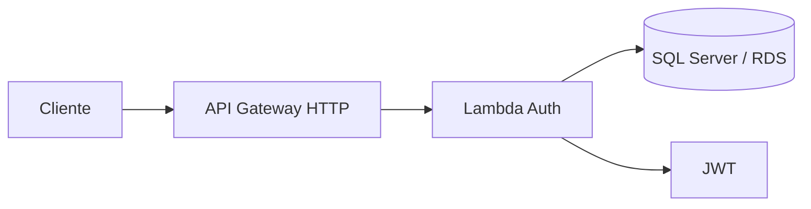

# fiap-garageflow-lambda-auth

Lambda Node.js que autentica clientes por CPF, consulta o SQL Server e emite JWT para a API GarageFlow.

## Pre-requisitos

- Node.js 20+
- AWS CLI configurada
- Terraform 1.8 ou superior
- RDS SQL Server acessivel a partir das subnets privadas da Lambda

## Variaveis da Lambda

| Variavel Terraform | Uso |
|---|---|
| `lambda_subnet_ids` | Lista JSON de subnets privadas com rota para o RDS |
| `lambda_security_group_ids` | Lista JSON de Security Groups da Lambda |
| `db_host` | Endpoint do RDS |
| `db_port` | Porta; padrao `1433` |
| `db_name` | Nome do banco |
| `db_user` | Usuario do banco |
| `db_password` | Senha do banco |
| `jwt_secret` | Chave usada para assinar o JWT |
| `jwt_issuer` | Emissor; padrao `GarageFlowService` |

A Lambda recebe estas variaveis em runtime: `DB_HOST`, `DB_PORT`, `DB_NAME`, `DB_USER`, `DB_PASSWORD`, `DB_ENCRYPT`, `DB_TRUST_SERVER_CERTIFICATE`, `JWT_SECRET` e `JWT_ISSUER`.

## Instalacao local

```powershell
npm ci
npm test
```

`npm test` valida a sintaxe do `index.js`. A execucao local completa exige as variaveis do banco e da assinatura JWT.

## Deploy com Terraform

```powershell
terraform init
$env:TF_VAR_lambda_subnet_ids='["subnet-privada-a","subnet-privada-b"]'
$env:TF_VAR_lambda_security_group_ids='["sg-lambda"]'
$env:TF_VAR_db_host='garage-flow.xxxxxxxxx.us-east-2.rds.amazonaws.com'
$env:TF_VAR_db_name='garage-flow'
$env:TF_VAR_db_user='garage_flow'
$env:TF_VAR_db_password='sua-senha-do-rds'
$env:TF_VAR_jwt_secret='chave-longa-e-aleatoria'
terraform plan
terraform apply
```

Nao versione esses valores. Em CI/CD, use o ambiente GitHub e configure:

- Secrets: `AWS_ACCESS_KEY_ID`, `AWS_SECRET_ACCESS_KEY`, `LAMBDA_SUBNET_IDS`, `LAMBDA_SECURITY_GROUP_IDS`, `DB_HOST`, `DB_NAME`, `DB_USER`, `DB_PASSWORD`, `JWT_SECRET`;
- Variable: `AWS_REGION`, normalmente `us-east-2`.

O Terraform cria a Lambda, a permissao de execucao e um API Gateway HTTP com `POST /auth`. Ao final:

```powershell
terraform output -raw api_gateway_url
```

Teste com:

```powershell
Invoke-RestMethod -Method Post `
  -Uri "$(terraform output -raw api_gateway_url)/auth" `
  -ContentType "application/json" `
  -Body '{"cpf":"12345678909"}'
```

## Fluxo de autenticacao

1. Recebe o CPF.
2. Normaliza e valida o documento.
3. Busca o cliente no banco.
4. Verifica se o cliente esta ativo.
5. Emite um JWT com os claims do cliente.

## Arquitetura


