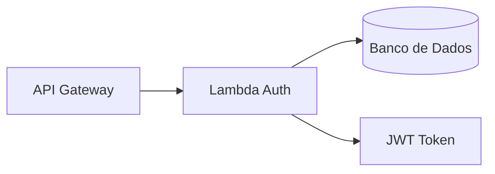

# fiap-garageflow-lambda-auth

## Objetivo
Autenticar clientes por CPF, validar o cadastro no banco, verificar o status do cliente e gerar um JWT para uso nas APIs protegidas.

## Requisitos
- Node.js 20+
- AWS Lambda
- SQL Server acessível pela função
- JWT secret configurado

## Variáveis de ambiente
- DB_HOST
- DB_PORT
- DB_NAME
- DB_USER
- DB_PASSWORD
- DB_ENCRYPT
- DB_TRUST_SERVER_CERTIFICATE
- JWT_SECRET
- JWT_ISSUER

## Fluxo de autenticação
1. Recebe CPF no payload
2. Normaliza e valida o CPF
3. Busca cliente na base
4. Verifica se o cliente está ativo
5. Emite JWT com claims do cliente

## Endpoint de exemplo
```json
{
  "cpf": "12345678909"
}
```

## Deploy
O Terraform deste repositório provisiona a Lambda e um API Gateway HTTP com a rota `POST /auth`. O deploy exige variáveis sensíveis no ambiente do GitHub Actions, incluindo subnets privadas, security groups, credenciais do RDS e `jwt_secret`.

## Arquitetura

